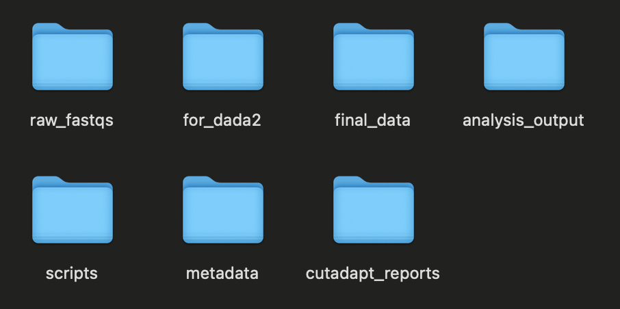

# MURI Metabarcoding Pipeline

This pipeline performs metabarcoding analysis using Cutadapt and DADA2. For more information on usage and dependencies, visit the wiki: https://github.com/MMARINeDNA/metabarcoding_QAQC_pipeline/wiki

# Getting Started:

## Step 1: Pull the Repository
--- 
Before running this metabarcoding pipeline, it's important to make sure you have the most updated version of scripts and (more importantly) found ASV databases. To do this, pull the most recent version of the github repo*:

```
# run from the cloned github repository
git pull
```
*Remember that GitHub/Git performs version control. What this means for you is that if you make changes to these files on your local machine and then try to `git pull` again, you will receive a warning or error message, because your files have changes that have not been committed to Git. The easiest way around this is to not change the files you pull from this repo.

## Step 2: Create File System/Update Files
---

Below is the file system that this pipeline assumes:

<p style="text-align:center;"></p>

To create this filesystem on your computer, run the following line from the repo directory:

```
sh config.sh {path where to create muri_metabarcoding}
```
This will create a directory called muri_metabarcoding in the given directory, and the filesystem will be created inside that directory.
For example, if I wanted to create these files on my desktop, I would run:

```
sh config.sh ~/Desktop/
```
Now, the filesystem is now found at `~/Desktop/muri_metabarcoding`.

**If you already have the filesystem on your system, the following command will copy over the updated files from the github repo to the filesytem**

```
cp ./bin/* {pathway to muri_metabarcoding}/scripts
cp -r ./metadata/* {pathway to muri_metabarcoding}/metadata
```

For example:
```
cp ./bin/*  ~/Desktop/muri_metabarcoding/scripts
cp -r ./metadata/* ~/Desktop/muri_metabarcoding/metadata
```

## Step 3: Move Raw Fastq's into raw_fastq
---
Copy your raw fastq's into the raw_fastq directory.  A command that would do this would look like:

```
cp /path/to/fastqs/* /path/to/raw_fastqs
```

## Step 4: Run metabarcoding_wrapper.sh
---
The metabarcoding wrapper takes 2 inputs:
* path to your file system (named muri_metabarcoding)
* run name (can be any name)

To run this script, use the following command:
```
bash metabarcoding_wrapper.sh {pathway to muri_metabarcoding} {run name}
```
Example:
```
bash metabarcoding_wrapper.sh ~/Desktop/muri_metabarcoding/ MURI304
```

## Step 5: Push the updated ASV databases
---
To keep the ASV databases updated, push your updated databases to the github repository.

*If you're not an admin for the repo skip this step!*

```
# RUN FROM CLONED REPOSITORY
# copy the updated ASV databases into the repository
cp {pathway to muri_metabarcoding}/metadata/known_hashes/* ./data/known_hashes/

# commit and push updated databases
git add ./data/known_hashes/
git commit -m "update known_hashes $(date +"%T")"
git push
```


